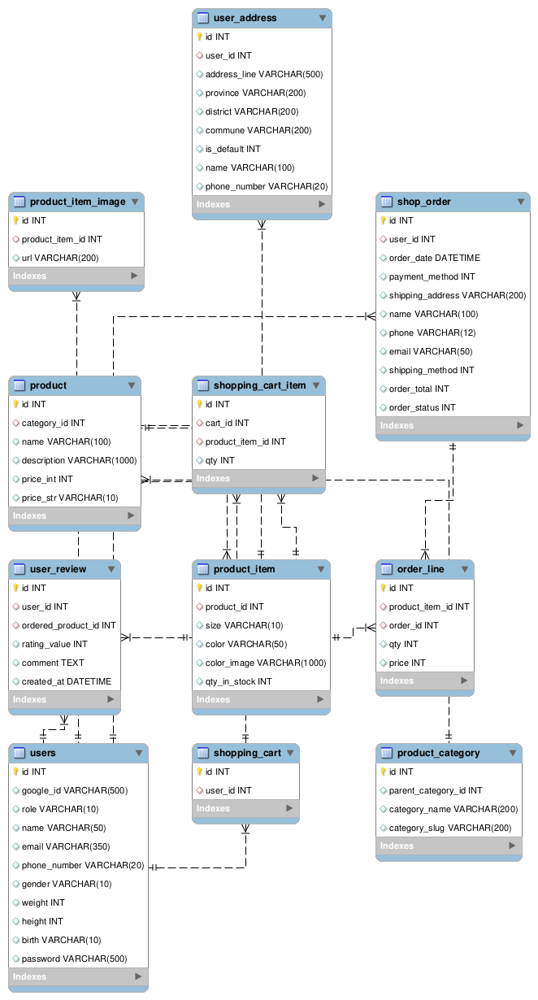

# A RestAPI back-end service for a Clothing website 

## Table of contents:
- [ Responsibilities](#head1)
- [API Documentation](#postman)
- [ To-do](#head2)
- [ Database Schema](#head3)
- [ How i Dockerize this project and local database](#head4)
- [ How i crawl data and store it in MySQL using Python and Javascript](#head6)

## Responsibilities:
- Led a team of 3 members (2 frontend developers and myself as backend developer) to ensure cohesive project development and integration.
- Implemented a comprehensive set of features for both users and administrators in an e-commerce website using MVC architecture.
- Designed and optimized a detailed database structure for efficient data management.
- Integrated VNPay payment gateways for website functionality.
- Utilized Redis to temporarily reserve user orders during the payment process.
- Implemented JWT authentication for secure API access, and \textbf{role-based authorization middleware} for controlled resource access.
- Integrated Cloudinary for users to upload and retrieve images seamlessly from the cloud.
- Developed data crawling scripts using Python and JavaScript to collect data from a website and store it to the database.

## API Documentation:

## To-do:
- [ ] Idempotent
- [ ] Database pooling
- [ ] Debounce and throttle
- [ ] Cloud
- [x] Exception, error, auth handler,...

## Database Schema

## [How i Dockerize this project and local database](https://toilacube.hashnode.dev/i-should-have-learned-docker-earlier)

## [How i crawl data and store it in MySQL using Python and Javascript](https://github.com/toilacube/coolmate-data)
